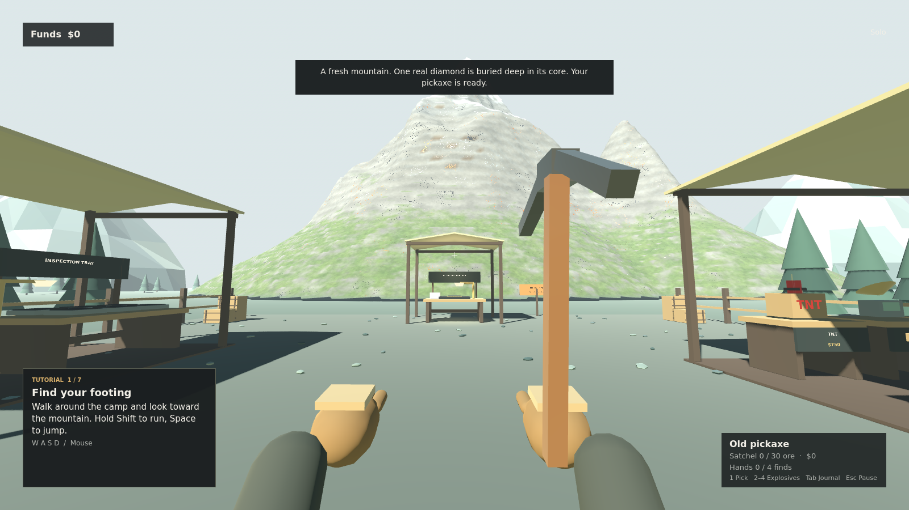
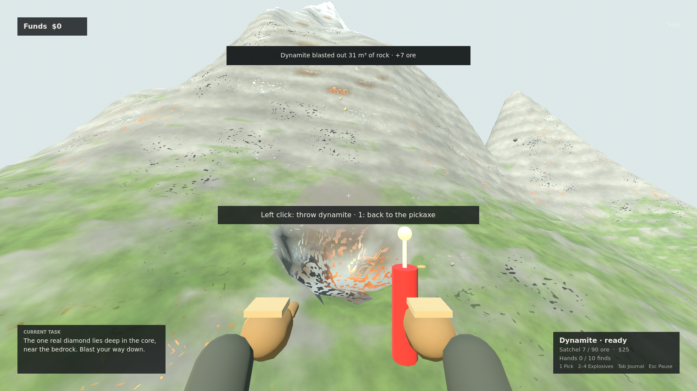
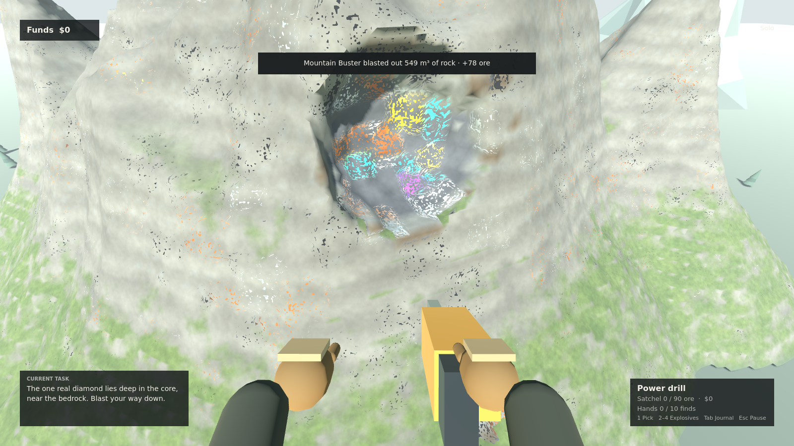

# DIAMOND IN THE ROUGH

**One real diamond. An unreasonable amount of rubbish.**

A playable native first-person 3D mining game built with Godot 4.6.2. Start with an old pickaxe at the foot of a big snow-capped mountain, mine ore, buy better tools and explosives, and blast your way to the one genuine diamond hidden in its core. Mine alone or share the mountain with up to three friends.







## Features

- A 144 × 128 m mountain rising about 70 m to a snowy summit: grassy foothills, three rocky shoulders, bare upper slopes and cliffs. Underneath its smooth surface are about 228,000 diggable 1 m cells of soil, stone, granite and bedrock, so tunnels and blast craters carve smooth pits into the rock.
- Fourteen ores in veins that get richer with depth: coal, tin, copper, iron, silver, turquoise, gold, topaz, amethyst, opal, emerald, sapphire, platinum and ruby.
- Exactly one diamond, buried at least 28 m deep in the core, with no look-alikes, plus 180 fossils and curiosities to collect.
- Hold-to-mine pickaxe with crack feedback, then a steel pickaxe and a power drill.
- Three thrown explosives with real fuses, physics and craters: dynamite, TNT and the Mountain Buster.
- An ore satchel, an ore magnet, treasure sonar that pings the diamond and fossils through rock, and an assay loupe that raises ore prices by 25%.
- Physical equipment models with attached names and prices at the camp outfitter: point at a model and press E to buy it.
- A seven-step playable tutorial, attached station signs and a compact UI that adapts to screen proportions.
- Collectibles, cosmetic rewards, harmless pranks and diamond certification at the camp bench.
- Host-authoritative ENet co-op for up to four players with shared funds and progression.
- Spatial push-to-talk voice: full volume within 2 metres, fading to silence at 12 metres.
- Automatic solo/host saves, disconnect recovery and a Lost & Found station.

## Play the Windows build

Download the ZIP from the [latest release](https://github.com/Outsourcedevv/diamond-in-the-rough/releases/latest), extract it and open `DiamondInTheRough.exe`. Godot is not required to play the exported game.

## Run and edit

1. Install **Godot 4.6.2 Standard**. The project uses GDScript and does not require the .NET edition.
2. Clone or download this repository.
3. Import the root `project.godot` file in Godot and press **F5** to play.

With Godot on your `PATH`, you can also launch it from the repository directory:

```powershell
godot --path .
```

The project uses the GL Compatibility renderer. The verified export target is Windows x64; other platforms have not been verified.

## Windows build

Install the matching **Godot 4.6.2 export templates** in the editor. Export the **Windows Desktop** preset to `build/DiamondInTheRough.exe`, or use:

```powershell
New-Item -ItemType Directory -Force build | Out-Null
godot --headless --path . --export-release "Windows Desktop"
```

The export embeds its game data in the executable. Builds and generated engine caches are ignored by Git.

## Controls

| Input | Action |
| --- | --- |
| WASD / mouse | Move / look |
| Shift / Space | Move faster / jump |
| E | Pick up a find, use a station or buy displayed equipment |
| Left mouse (hold) | Mine with the pickaxe or drill, or throw the selected explosive |
| Right mouse | Start or finish close inspection |
| Mouse / Ctrl + wheel | Rotate / zoom while inspecting |
| Wheel / Q | Select a carried find / drop it |
| 1 / 2 / 3 / 4 | Pickaxe / dynamite / TNT / Mountain Buster |
| C | Keep a fossil or curiosity on display |
| Tab / Esc | Ledger / pause |
| V / M | Hold to talk / toggle microphone mute |

Finds that fall out of the rock are picked up by walking over them. See [the playing guide](docs/PLAYING.md) for ores, equipment, pranks, saving and recovery.

## Co-op and proximity voice

Choose **Co-op → Host game** on one PC. Friends choose **Co-op**, enter its IP address and the same UDP port (**24680** by default), then choose **Join game**. Allow the game through the host's firewall. For multiple instances on one PC, join `127.0.0.1`. Direct internet hosting requires a reachable host and may require port forwarding. The host must remain running.

Hold **V** to speak to nearby players; **M** toggles your microphone mute. Settings provides input-device selection, microphone gain and nearby voice volume. Voices follow player positions and stop beyond 12 metres. Solo play and menus do not transmit. The game does not record voice or store it in saves. All peers must run the same version.

Voice uses 16 kHz mono G.711 mu-law audio over a dedicated ENet channel. Physical microphone hardware and speech quality still require a manual co-op check. Use headphones; echo cancellation is not implemented.

## In-game updates

Open **Updates** from the title or pause menu to download a newer build and **Save & restart to install**. Automatic checks run on startup and every five minutes. Successful pushes to `main` are built and published by GitHub Actions; failed builds are not offered. The private repository requires an existing GitHub CLI sign-in or a read-only token kept for the game session. Read [the update guide](docs/UPDATING.md) for setup, recovery and build behavior.

## Development and verification

The mountain, camp geometry, materials and sound effects are generated in code. The root scene loads the scripts in `game/`:

| File | Responsibility |
| --- | --- |
| `game/main.gd` | Session orchestration, interactions and visible objects |
| `game/state.gd` | Authoritative mining, blasting, items, purchases, saves and networking |
| `game/mountain.gd` | Deterministic mountain: smooth shape, diggable cells, layers, hardness and ore veins |
| `game/mountain_view.gd` | Smooth chunked rock surface built on a worker thread, collision, rock/grass/snow shader and sonar pings |
| `game/player.gd` | First-person movement, tools and held-object inspection |
| `game/workshop.gd` | Camp, scenery, physical equipment displays, stations and explosive models |
| `game/interface.gd` | Menus, settings, ledger and HUD |
| `game/sound.gd` | Synthesized sound effects |
| `game/voice.gd` | Microphone capture, codec and spatial voice playback |
| `game/tutorial.gd` | Event-driven first-session guidance and local completion preferences |
| `game/redesign_verification.gd` | Physical purchases, tutorial progression and screen-layout checks |
| `game/verification.gd` | Solo progression and native co-op integration harness |
| `game/voice_verification.gd` | Synthetic native voice integration harness |

Read [DEVELOPMENT.md](DEVELOPMENT.md) for architecture and reproducible commands, and [VERIFICATION.md](VERIFICATION.md) for tested behavior and limits. Integrated verification uses isolated saves and generates reports locally.

## Prototype scope

This is a playable prototype. Steamworks, invitations, achievements, internet matchmaking, relay/NAT traversal, Opus and full ragdolls are not implemented. Digging works on 1 m cells under a smooth surface. There are no cave-ins: rock never falls, and loose finds settle onto the rock beneath them. See the development notes for these simplifications.

## License notices

No license has been selected for this game's original source and assets. The Godot Engine and its third-party notices are included in [licenses/](licenses/); those notices do not grant a license to the game's original code or assets.
