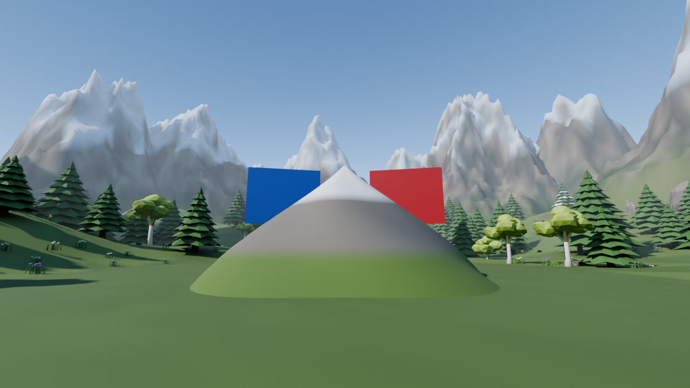
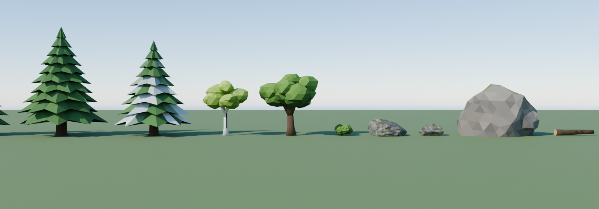

# Diamond Rush: TikTok Live Roblox game

A Roblox version of Diamond in the Rough made for TikTok LIVE. A big mountain made of **250,000 rocks** (one rock is one stone) is shown counting down at the top of the screen. The rock slopes smoothly towards open air, with snow on the summit, grassy foothills over a dirt layer and layered stone inside: finding the one small diamond should feel like finding a needle in a haystack. Every gift, like, follow and share from your viewers blasts stone out of it. Once the diamond is exposed, find it, click it and **hold it for 15 seconds** to win.

- **Royal lobby.** Everyone arrives in a closed white marble palace floating in the sky: a grand hallway of columns, chandeliers and royal blue banners leads to a domed throne room with a giant turning diamond. Each game has its own room off the hallway with a glowing portal to walk into, and the games menu on the left joins them too; more games are marked *Coming soon*. See [The lobby and the games menu](#the-lobby-and-the-games-menu).
- **Stone counter.** The top of the screen shows how much stone is left (250,000 to start), with a progress bar.
- **Gifts blast the mountain.** Each TikTok coin removes 100 rocks, so a Rose (1 coin) removes 100 and a Galaxy (1,000 coins) removes 100,000. The counter always equals the rocks really left. Likes, follows and shares also chip away. Big gifts make big explosions. A feed in the corner shows who sent what.
- **Diamond bird.** Every 5 to 7½ minutes (at random) a sparkling bird made of diamond swoops down from the sky and circles the mountain about halfway up, flapping its glass wings. Click it and **every gift counts double for 30 seconds**: gifts that blast stone remove twice as much, gifts with an add rule add twice as much, the gift animation is sized for the doubled gift and the coins count double on the leaderboard. The display shows **DIAMOND BIRD · CLICK IT FOR 2X GIFTS** while it is flying, and a gold **2X** card with the seconds left sits beside the stone count while the bonus runs; doubled gifts show 2X in the feed. Gifts are doubled if they arrive during the 30 seconds, even if the mountain is still busy with earlier gifts. Aim the dot at it in first person: the dot turns gold and grows when a click will catch it, so you don't have to hit the bird exactly (it counts within a few degrees), and on a phone you tap it. The click goes to the server, which checks the bird is still circling and that you are within 300 studs of where it is flying. If nobody catches it, it flies off when the next bird arrives. Catching another bird during the bonus restarts the 30 seconds (gifts are doubled, never quadrupled). The **Y** panel has **Send a diamond bird now** for testing, and the timings are in `src/shared/Config.luau` (`BirdMinSeconds`, `BirdMaxSeconds`, `BirdBoostSeconds`, `BirdMultiplier`).
- **Gift animations.** One gift's coins pick one of six hand-made effects, each bigger than the last. A combo plays as separate gifts: Galaxy x10 is ten Galaxy Collapses one after another (each with its own blast and feed line), not one 10,000-coin effect. Gifts in a combo are spaced about half an effect apart, and very long combos (Rose x500) are shared out over at most 20 gifts:
  - **Spark Burst** (1–9 coins): a golden pop with sparks, a puff of dust and a small ground ring.
  - **Shockwave** (10–99): a double shockwave ring races across the ground while sparks, embers and chunks of rock fly.
  - **Diamond Fracture** (100–499): glowing cracks spread over the remaining rock, ice-blue crystals burst up out of them, and then they shatter into glittering shards.
  - **Orbital Strike** (500–999): a target ring locks on while a charge gathers high in the sky, then a beam slams down, the screen flashes and fire, smoke and embers erupt. A barrage of four more strikes walks round the crater, and a wider beam with three rings finishes it (about 4½ seconds).
  - **Galaxy Collapse** (1,000–9,999): a black hole opens over the rock with a spinning ring of stars and pulls light in from all round, then goes nova. The stars fling out in spiral arms, the hole flickers back for a second pulse, and a beam of starlight pours into the mountain with sparks raining down (about 5 seconds).
  - **Cosmic Burst** (10,000+): the sky darkens for the whole show, a storm of twelve meteors rains down round the target, then a blazing comet strikes with a mushroom of fire and smoke, three shockwaves and a pillar of light. Fire geysers erupt in a ring, a second wave of meteors falls, and a final cosmic shock flashes the sky white and rolls rings out across the valley (about 7 seconds).

  The effects use Roblox's own particle textures (sparkles, fire, smoke, embers and shockwave rings), neon parts with trails, lights, a gentle camera shake and a brief colour grade. Flying rock and dust match the mountain skin, so the haystack throws hay.

  Gifts that add stone have their own six effects, in greens, played on the summit:
  - **Pebble Drop** (1–9 coins): pebbles fall onto the peak with puffs of dust.
  - **Rockslide** (10–99): a ring of rocks rises out of the slopes and tumbles in.
  - **Stone Surge** (100–499): green veins race in from all round, then stone pillars thrust up, lean in and sink into the peak.
  - **Boulder Barrage** (500–999): a dozen boulders are hurled in from far away, trailing dust, and crash home one after another, then the peak heaves with a ring and a pillar of light (about 4 seconds).
  - **Stone Cyclone** (1,000–9,999): 32 rocks from the valley spiral up into a towering cyclone round a pulsing green core, slam down into the peak, and a second ring and pillar blast out (about 4½ seconds).
  - **Mountain Rising** (10,000+): the sky turns, the ground rumbles and green light cracks outward, then a colossal boulder descends slowly, pulling 26 rocks up off the slopes, and lands with a blast of light. A ring of eight green pillars erupts round the mountain and the peak pulses once more (about 5½ seconds).

  The rocks that come back still fly into place one by one, in stone or hay to match the skin. The six **REBUILD TEST GIFTS** buttons in the Y panel play these effects in order, smallest to biggest. A banner shows the effect, the sender, the gift and the coins. The effects are cosmetic: they never collide, block digging or cast shadows. At most two play at once (expensive gifts take priority), each is capped (70 parts and 3 lights for the small tiers, up to 160 parts and 4 lights for the biggest), and everything is cleaned up within 12 seconds. Gift blasts only remove mountain stones: they never target the diamond, and the gem settles above the actual visible stone or ground after each blast. To see each effect, use the Y panel's test presets (Rose, Doughnut, Hand Hearts, Money Gun, Galaxy and Lion cover all six tiers, and Galaxy x10 shows a combo as ten Galaxies); each button shows the coins for one gift, Test gifts use these same effects.
- **Find and click the diamond.** The uncovered message tells you when it can be found, but there is no floating location label, through-rock outline or light beacon. Aim directly at the gem and left-click (tap on mobile) within 12 studs. Walking into it and pressing E do not pick it up; rocks cannot be clicked through.
- **Hold the diamond.** The gem flies from where it lay into your right hand, your hand lifts it high and your view eases upward, framing a large, sparkling diamond against the sky. The eight-sided gem has a pale crown, a bright table and a deeper blue pointed base, so it reads clearly as a diamond on stream. A visible palm, thumb and curled fingers grip it. **You cannot move while holding it:** you stay frozen in place until you win or a rebuild gift cancels the hold. The countdown occupies the top-centre HUD while holding, leaving the hand and gem clear below it. Other players see a big sparkling diamond in your avatar's raised hand.
  - A big countdown shows **10 → 0**, but it really takes **15 seconds**: the numbers tick fast at first and slow down near the end.
  - If you fall or leave, the diamond drops.
- **Scenery.** An alpine valley in smooth terrain, with grassy meadows and animated grass, a lake with a dock, a log-cabin mining camp with a porch, warm windows, a campfire and lanterns, and a timber fire lookout on a hillside to the left of the mountain, with braced log legs, a ladder, a lamp-lit lookout under a shingle roof and a red flag (alpine only; it is put away in the sakura theme). The valley is ringed by huge snow-capped mountains made in Blender and filled with about 200 pines (snow-dusted higher up), birches, oaks, mossy boulders, rock outcrops, bushes, wildflower patches, fallen logs and stumps. The game builds these meshes itself when it starts, so there is nothing to import (see [Blender scenery](#blender-scenery)). Where Roblox does not allow that (a published game without Mesh / Image APIs turned on), built-in low-poly trees, terrain boulders and terrain peaks are used instead. The place uses Future lighting and Roblox's 2022 material pack, with atmosphere haze, sun rays, bloom and a gentle colour grade.
- **Sakura theme.** The map can switch between the alpine valley (the default), a sakura spring, a farm, a desert canyon and a haunted night (below). Sakura adds about 50 cherry trees in blossom across the meadows and round the camp, each with fallen petals beneath it, a vermilion torii gate where the trail leaves the camp (framing the mountain from the spawn, in place of the festoon lights) stone lanterns at the camp and on the dock, and a Shinto shrine on a flat meadow to one side of the mountain, facing the camp. The shrine has a stone plinth with steps, vermilion pillars, paper screens, a curved copper roof with crossed finials, a sacred straw rope with paper streamers, a bell, an offering box, a golden mirror on its altar and its own small torii on the approach. The light turns to a lower golden sun through a soft pink haze, with fresh green meadows and blush-tinted clouds, and cherry petals drift down around everyone playing. Choose it from **THEMES** on the sidebar (**Alpine** is free; the others can be sold for Robux, see [The sidebar](#the-sidebar)). It changes for everyone straight away, without restarting, and the game remembers the choice. The looks are in `src/server/Scenery.luau` (`LOOKS`) and the sakura scenery in `src/server/Sakura.luau`.
- **Farm theme.** The third map theme turns the valley into a ranch. A timber board fence runs all the way round the mountain's arena, open only where the trail comes in from the camp, under a log gate arch. Beyond the fence, on open ground in view of the spawn, stands a red gambrel-roofed barn with white trim, big X-braced doors, a hayloft, a cupola and weathervane and a concrete silo, with a cornfield and a scarecrow beside it, a windpump, a little red tractor, stacked and round hay bales, and cows grazing round a water trough. The light is a warm harvest-time sun through a golden haze. The fence is solid but low enough to hop. Choose it from **THEMES** on the sidebar (**Farm**). It hides the alpine festoon lights and watchtower, and works with either mountain skin (hay and a needle suits it). The farm scenery is in `src/server/Farm.luau`. The barn (with its silo), the sakura shrine (with its torii) and the alpine lookout are built 1.5 times their drawn size so they stand out from the camp; change `Farm.BARN_SCALE`, `Sakura.SHRINE_SCALE` or `Watchtower.SCALE` to resize them, and the ground they need is found to match.
- **Desert canyon theme.** The valley turns to red sand under a hot, high sun and a dusty amber haze, with bleached peaks and a turquoise oasis. Layered sandstone mesas and buttes stand round the valley, saguaro and barrel cacti and tumbleweeds dot the sand, and palms lean over the lake. Where the trail leaves the camp, a sandstone gate with fire bowls frames the mountain. To one side of the mountain, facing the camp, is a stepped sandstone pyramid with a steep stair up its front to a temple with a gold capstone, obelisks and fire bowls at its foot; the pyramid and stair can be climbed. The pine forest, birches, bushes, flowers, logs and stumps are hidden while the desert shows (the rocks and cliffs stay). The scenery is in `src/server/Desert.luau`.
- **Haunted night theme.** Midnight under a big full moon, with cold blue mist, dark grass and stone, and glowing lanterns. An iron cemetery gate between stone pillars, its doors swung open and a green lantern hanging from its spiked arch, stands where the trail leaves the camp. To one side of the mountain is a stone mausoleum with columns and a green glow leaking round its iron door, beside a graveyard of crooked headstones and crosses behind a spiked iron fence, with will-o'-wisps drifting over the graves and the lake. Bare dead trees stand across the meadows, and carved jack-o'-lanterns glow at the gate, the camp, the crypt steps and the graveyard. The dark pines stay; the flowers, birches and oaks are hidden. The ambient light stays bright enough to see the rock you dig. The scenery is in `src/server/Haunted.luau`; which of the valley's trees each theme hides is in `src/shared/SceneryThemes.luau`.
- **Haystack skin.** The mountain itself can be reskinned as a haystack with a **needle** hidden in it instead of a diamond: the same game, the same rules, only the look changes. The rock turns to straw (sun-bleached on top, greener fresh hay low down, packed hay and golden bales inside) and the gem becomes a steel needle with a red thread through its eye, found, clicked and held exactly like the diamond. The display follows: **HAY LEFT**, **NEEDLE UNCOVERED**, **NEEDLE SECURED!** and the lobby's status line. Choose it in the **Y** panel under **MOUNTAIN SKIN** (**Stone & diamond** or **Hay & needle**). It works with either map theme, changes for everyone straight away and is remembered. The palettes are in `src/shared/RockStyle.luau` (`HAY_LAYERS`), the needle in `src/shared/DiamondShape.luau` and the words in `src/shared/Skin.luau`.
- **Leaderboards.** Two giant 3D wooden boards stand behind the mountain, either side of the summit, angled towards the camp: **TOP HELPERS** (blue border, a pickaxe on the roof) ranks viewers by the coins they sent in gifts that break the mountain, and **TOP GRIEFERS** (red border, boulders on the roof) by the coins they sent in gifts that add stone (gifts with a negative rule). Each shows the top 10 on a shingle-roofed board with log posts. Totals are saved between streams, viewer names are text-filtered, and test gifts never count.
- **Gold statues.** Honour a big gifter with a gold statue holding a diamond aloft on a marble pedestal. An engraved brass plaque shows their name and coins. Statues are placed and removed from the settings panel and saved to the player who built them (see [single player](#the-published-game)).
- **Win counter.** It sits under the stone count and is fully customisable: title, number, an optional goal (e.g. `WINS: 3/10`), text colour and background colour. It is saved between streams.
- **Win screen.** It shows for 4 seconds with **This round's time** and **Best round's time** (and NEW BEST TIME when you beat it). Then the mountain rebuilds from base to peak in 16 waves, with flying stones snapping into place and a final glint at the summit. Gifts arriving during the rebuild are saved and applied when digging resumes.
- **Loading screen.** Joining shows a royal blue loading screen in place of Roblox's own: the title, a turning diamond, a gold progress bar that fills as the place loads, the palace is built, your character arrives and the game's display starts, and tips about the controls. It stays at least 2.5 seconds, never more than 45, and fades away. It's `src/first/init.client.luau` (ReplicatedFirst).
- **Sprint.** Hold **Shift** to move 1.5 times as fast, everywhere: in the lobby, the mine, Diamond Climb (1.5 times the speed you set) and on the way to the chalkboard. On a controller press the left stick; on a phone hold the **Run** button. Holding the diamond or writing on the board still keeps you still. The speed is `SprintMultiplier` in `src/shared/Config.luau`, and the code is `src/client/Sprint.luau`.
- **Settings and field of view.** **SETTINGS** on the sidebar (or **P**, which frees the mouse in first person; it used to be O, but O is Roblox's zoom-out key and Roblox swallowed it) has a **Field of view** slider from 50 to 100 (70 by default) with **Reset** and **Done**, and switches that hide things: the sidebar itself, Diamond Climb's speed and jump sliders, Chalkboard Count's writing speed card and the win counter. The game remembers them for that player (the win counter for everyone). The hands are refitted to the field of view, so they keep the same size and place on screen and the dig swing looks the same at any setting. The field of view applies only in the game (the lobby keeps the normal view) and lasts for the session.
- **Clean display.** The on-screen display uses one style throughout: Gotham type, dark see-through panels with a fine edge, white text, a pale blue accent and gold for wins, and no emojis (in the game) except the gift icons in the gift settings. There are no lettered signs in the world (their text renders badly in Roblox); only the leaderboards and statue plaques carry text.
- **Aim at stone.** A small dot marks the centre of the screen. The surface rock directly under it gets a white outline; the outline follows the same target used for digging and disappears when aiming away or opening settings.
- **Dig with your hands.** First-person view with two hands: hold the left mouse button on the mountain and your hands take turns, four swings a second: each draws back, drives forward into the rock with the fingers clawed, and rakes the rubble down and back. The rock breaks as each hand lands (25 rocks a strike, about 100 a second), so what you see and what you dig stay in step. A swing always finishes once begun, so letting go never snaps a hand back. The hands are drawn small and close to the camera, so they never sink into the rock when you stand right against it. Connected, hinged fingers curl during the scoop; sleeves meet the palms, and the real avatar arms are hidden locally to prevent duplicate floating limbs; the animation pauses when you aim away from reachable stone.

## Gift settings and TikFinity

In the game, press **Y** and click **Open gift settings (full screen)**. About 125 TikTok gifts are listed with an emoji icon, their coins and a search bar. TikTok's own gift pictures are its artwork and can't be put in a Roblox game, hence the emoji. Prices differ by country, so any gift's coins can be changed, and a gift that's missing can be added with its coins. Pick a gift to set:

- **Diamond in the Rough:** rocks per gift (negative adds stone),
- **Diamond Climb:** platforms per gift (negative sends the climber down),
- **Chalkboard Count:** numbers per gift (negative counts down),
- **Wins:** wins per gift, e.g. `1` or `-1` (or more), added to or taken from the win counter of whichever game is being played (wins can go below 0),
- **Animation:** the show the gift plays, from 1 (smallest) to 6 (biggest), named in each game (e.g. 3 is Diamond Fracture / Stone Surge, Rocket Boost / Anvil Smash, Paper Planes / Sponge Splash), or **Auto** to let the coins pick,
- **Reset:** switch it on and the gift sends whichever game is being played back to the start: a full mountain again in Diamond in the Rough (back to the starting stone), platform 0 in Diamond Climb, or a count of 0 in Chalkboard Count. A reset gift does nothing else,
- **a keybind:** press **Set key**, then a key: letters like K, numbers, the number pad, Insert, Home, End, Page Up/Down or Delete, on their own or with **Shift** or **Ctrl**, so there are hundreds to give out, and F1 to F8 on their own (Roblox uses Shift and Ctrl with the F keys for its stats screens).

Leave an amount empty to work it out from the gift's coins. **Save**, and **Test gift** to see it. Pressing a gift's key in the game sends that gift.

**With TikFinity:** this is how gifts on your LIVE reach the game. In TikFinity, add an action that **simulates a keystroke** (the gift's key, with Shift or Ctrl if you chose them) and an event that runs it when that gift is received. Keep the Roblox window focused while you stream, and every gift on your LIVE reaches the game through its key. To make likes, follows or shares do something, have TikFinity press a gift's key for them. Gifts sent by keys show as "A viewer sent …" in the feed and don't count on the leaderboards (the key doesn't say who sent it).

## Adding stone

Add gifts refill previously dug spaces, with stones flying and snapping into place. After refilling dug spaces, surplus blocks grow new connected rock outside the existing surface. Growth stops at GrowthMaxStone (1,500,000 by default), or twice the starting stone if larger, and never fills the diamond cell; a revealed diamond is moved above the restored surface. Gifts queued during a win/rebuild are applied in arrival order. A gift removes stone until you give it a negative **Diamond in the Rough** amount in the gift settings: negative amounts add and positive amounts remove.

## Rebuild tests

Rebuilding any rocks during a diamond hold cancels that hold, clears the countdown and lets the holder move again. Dug spaces refill from the diamond outward. Players covered by restored rock are lifted onto the new surface. A rebuild that actually restores at least 10,000 rocks moves the former holder to the highest restored rock surface instead. Each player's computer draws the returning rock a moment after the server restores it, so a player could land back in the old hole and have the rock appear round them. To stop that, for 6 seconds after any rebuild the server checks every 0.4 seconds whether anyone is standing inside rock and lifts them onto it. A player standing in a shaft they dug themselves is left alone. The diamond is released beside the player, above the rock, ready to click again for a fresh countdown. An add gift at the growth limit that restores zero rocks does not interrupt the hold. During the countdown, the holder sees a larger bright outlined gem above their palm; other players see an outlined diamond in the raised hand.

In the game's **Y settings panel**, scroll to **REBUILD TEST GIFTS**. Choose **+100**, **+1,000**, **+10,000**, **+50,000**, **+100,000**, or **Grow to limit**; each plays the next adding effect, from Pebble Drop to Mountain Rising. These tests work offline and always rebuild, whatever the gift settings say. They refill previously dug spaces, then enlarge the mountain up to its growth limit, and preserve the round and wins. They also work on an undug mountain.

## Gift performance and mountain growth

Gift mutations run through one ordered worker. Large blasts, restoration and growth yield between short chunks rather than doing all work in one frame. Animations start when a gift begins processing; the status shows queued work and the stone counter updates as work progresses. You can keep digging while a gift blasts or rebuilds the mountain. The diamond shows the moment a gift uncovers it, and you can pick it up straight away while the rest of the gift keeps blasting (not while a rebuild gift is refilling rock). Every change is sent to the players as one net change per rock, so overlapping gifts and digging never leave a destroyed block on screen. Round resets wait for the current mutation to finish. Players are kept above newly built surfaces.

**The server has no rock parts.** It keeps only the rock grid and streams compact change lists (column runs, 6 bytes each) to every client, which draws the rock itself. The server spends up to 8 ms of each frame on a gift (it draws nothing, so players never feel it), and each client at most a few milliseconds a frame on rock work, so a 100,000-rock gift opens its crater in about half a second instead of freezing the game. Rock parts cast no shadows and small scenery props (under 3 studs across) don't either, which takes the biggest load off the renderer. A 100,000-rock blast is about 23 KB of network traffic; it used to replicate thousands of parts. A 250,000-rock mountain needs about 13,400 parts (it used to need about 26,200): slope-shaped surface rock closes the shell by itself, so the hidden backing layer is gone. Cell occupancy, crater queues and growth frontiers use bit-packed buffers to avoid hash-table resize stalls.

Run `luau tests/gift-performance.luau` for a CPU checkpoint timing report and `python3 tests/mountain-sync.py` for client build and network sizes. Rendering cost and frame rate still need checking on the streaming PC.

## What you need

- **Roblox Studio** (free from [create.roblox.com](https://create.roblox.com)) to open and publish the game.
- **TikFinity** on the PC you stream from, to press the gifts' keys.
- This folder: on GitHub click **Code → Download ZIP**, then extract it.

## Set up (once)

1. Double-click **DiamondRushTikTok.rbxlx** to open the game in Roblox Studio.
2. Press **Play** (F5). You arrive in the royal lobby: press **JOIN** on **Diamond in the Rough** in the games menu on the left.
3. Press **Y** and try the **TEST GIFTS** buttons. The mountain should blow up.
4. Press **Open gift settings**, give your gifts their keys, and set up TikFinity to press them (see [Gift settings and TikFinity](#gift-settings-and-tikfinity)).

## Every stream

1. Go **LIVE on TikTok**, with TikFinity running.
2. Open the game (the published game, or Studio and **Play**), then **JOIN** a game from the games menu.
3. Click on the Roblox window so it's focused, and keep it that way: TikFinity's key presses only reach the window in front.
4. Capture the Roblox window in TikTok LIVE Studio or OBS.

## The lobby and the games menu

Players start in the lobby, a white and gold royal palace floating high in the sky away from the mountain. It is closed all round, with walls and ceilings everywhere, so no sky shows inside and nobody can fall off. You arrive at one end of a long **grand hallway**: a royal blue carpet runs down it between marble columns with gold sconces and royal blue banners, under a row of chandeliers, to the **throne room**, a round domed hall where a giant diamond turns over a marble dais.

Four **rooms** open off the hallway, two on each side, each with a drawn emblem over its door:

- On the left, **Diamond in the Rough** (a mine with rock walls, timber supports, glowing crystals and a little mountain with the diamond on top) and **Chalkboard Count** (a classroom with a chalkboard, a teacher's desk, a clock and a bookshelf).
- On the right, **Diamond Climb** (violet crystal walls, a crystal tower with platforms spiralling round it, and steps to hop up) and the **Coming soon** room, behind a closed gold gate, where something covered waits under a spotlight.

At the back of each game's room is a glowing **portal**: walk into it, or press **E** at it, to join that game. It does the same as **JOIN** in the games menu. The rooms and the palace are built by `src/server/Lobby.luau` (`Lobby.ROOMS` lists the rooms).

The **GAMES** menu on the left of the screen lists the games:

- **Diamond in the Rough** shows what is happening right now (stone left, or that the diamond was found). Press **JOIN** to go to the mining camp.
- **Diamond Climb** shows the climber's platform and how many climbs they have won. Press **JOIN** to go to the tower (see [Diamond Climb](#diamond-climb)).
- **Chalkboard Count** shows the count on the board, the goal and how many times it was reached. Press **JOIN** to go to the classroom (see [Chalkboard Count](#chalkboard-count)).
- The last card says **Coming soon**, ready for a future game.

Beside the carpet near the spawn stands a **How to Play** board (drawn, with no lettering). Walk up and press **E**, or click it, and a guide opens on screen with six pages: **Connect TikTok** (setting up TikFinity and gift keys), **Testing** (the Y panel's test gifts, rebuild tests, the bird button and the gift settings), **Controls**, **How to win**, **Diamond Climb** and **Chalkboard**. The games menu's **How to play** button and the **H** key open it too, anywhere.

Press **Hide** to hide the menu. **GAMES** on the sidebar, or the **G** key, brings it back. The key matters in the game, where the mouse is locked to first person. While you play, the menu has **Back to lobby**. You can't go back while you are holding the diamond.

The mountain keeps going while you are in the lobby: gifts still blast it, and the game's display shows again as soon as you join.

## Diamond Climb

The second game: jump up **1,000 platforms** spiralling round a tall crystal pillar in the sky to the diamond at the top. Each platform is a little higher than the one before (2 studs at the bottom, 3.5 at the top) and every jump is a short hop, so it is easy with the normal jump. The spiral is wide, so the loop above is over 30 studs overhead: you never bump your head and it doesn't get in the camera's way. Each platform near you shows its number floating above it (gold for every hundredth). Every hundredth platform is bigger, with a gold rim and a gold ring round the pillar, and the gem colour changes: sapphire, emerald, ruby and on up to diamond.

- **Checkpoints.** Every platform you land on is your checkpoint. Fall off (or reset) and you are put straight back on it. Progress, best and climbs are saved with the rest of the game.
- **Landing.** Each landing makes the platform's rim swell and flash, a ring of light races out, sparkles fly up and a chime plays, rising in pitch through each ten platforms. Every hundredth platform adds fireworks and a gold shout on screen.
- **Movement.** The **MOVEMENT** card (bottom right) has **Speed** (8 to 40, 16 normally) and **Jump height** (4 to 15, 7.2 normally) sliders and **Reset**. They change straight away and are remembered. The camera is a normal third-person one you can zoom out further.
- **Gifts send you up or down.** While you climb, TikTok gifts that would break the mountain send you **up**, and gifts set to add stone send you **down**: 2 platforms for a Rose, 6 for 10 coins, 20 for 100 coins, 45 for 500, 63 for a Galaxy and 200 for 10,000 coins (each gift of a combo counts). Follows and shares lift you one platform; likes leave the climb alone. Gifts still count on the leaderboards, and the diamond bird's bonus still doubles them.
- **The rides.** Each gift picks you up and carries you round the tower to your new platform, and the display counts the platforms going by. Up: Bounce Pad, Spring Launch, Rocket Boost, Diamond Cannon, Starlight Ascent and Galactic Ascension. Down: Banana Slip, Spike Bounce, Anvil Smash, Meteor Strike, Thunder Hammer and Black Hole Plunge. From 100 coins the ride takes over the camera with fire, lightning, portals, fireworks and colour, and each tier is wilder than the last. Gifts that arrive together ride one after another, faster while more are waiting.
- **Winning.** Reach the diamond to win a climb; after the celebration the next climb starts at the bottom.
- **Streamer panel (Y).** **DIAMOND CLIMB** has **Restart at platform 0** and the climb's gift strength (**Half**, **Normal** or **Double** platforms per gift). **TEST GIFTS** send you up and **REBUILD TEST GIFTS** send you down, so every ride can be tried without TikTok.

While you climb, gifts move you instead of the mountain. Back in the lobby or the mine, they work on the mountain as before.

- **The wall.** Behind the start island stands a wall with 5,000 health (set it in the **Y** panel under DIAMOND CLIMB). Gifts keep pushing the climber back even at platform 0: every platform they would go below 0 takes 1 health off the wall. When the wall reaches 0 it breaks, the climber loses a win (wins can go below 0) and the wall is built again at full health. A climb to the top also rebuilds it. Its health shows over the wall and on the climb's display.

## Chalkboard Count

The third game: you stand at a big green chalkboard in a classroom while a fixed classroom camera films you (with a REC light and viewfinder corners on screen). **Hold** the left mouse button, Space or the screen and you write the next number, then the next, one after another. Reach the **goal** (1,000 to start) to win; after the celebration the board is wiped for the next count.

- **The board.** The count is drawn in chalk strokes, not text, so it never glitches: each new number is written stroke by stroke and your arm scribbles with a stick of chalk while you hold. The goal sits small in the top right corner beside a chalk target, and a chalk line along the bottom shows how far you are. The display at the top has the count, a progress bar, your best and your wins.
- **Writing speed and themes.** The **WRITING** card (bottom right) has a **Writing speed** slider (1 to 20 numbers a second, 3 normally) and five **themes** for the classroom: **Classic green**, **Blackboard**, **Neon night** (glowing chalk and neon strips), **Sakura** (pink blossom, a branch and paper lanterns) and **Royal diamond** (a gold-framed board, gold pillars, royal banners and a diamond above the board). Both are remembered.
- **Gifts move the count.** Gifts that would break the mountain write numbers for you, and gifts set to add stone rub them **off**, by the same amounts as Diamond Climb: 2 for a Rose, 20 for 100 coins, 63 for a Galaxy and 200 for 10,000 coins (each gift of a combo counts). Follows and shares write one; likes leave the board alone. Bigger gifts burst more chalk and shake the camera, and the eraser sweeps across for gifts that rub numbers off. The diamond bird's bonus still doubles gifts.
- **The reset.** A **Galaxy** starts a **60 second countdown**: a red banner on screen and a chalk clock on the board count down, and when it runs out the board is wiped back to 0. Anyone who sends a **different gift worth 1,000 coins or more** saves the board and stops the countdown. A second Galaxy while the countdown runs does nothing more, and the Galaxy that starts it writes nothing.
- **Streamer panel (Y).** **CHALKBOARD COUNT** sets the goal (10 to 5,000,000), the reset gift's name, the countdown (10 to 300 seconds), the coins that save it and the gift strength (**Half**, **Normal** or **Double**). **Restart at 0** wipes the board, and **Test reset** and **Test save** try the countdown without TikTok.

While you write, gifts move the count instead of the mountain. Back in the lobby or the mine, they work on the mountain as before.

- **The writer.** At the board your character is drawn twice as big and really writes: their right hand follows the chalk across each digit (an IKControl on R15 characters) and they step along the board to the digit being written. The writing speed card goes from 1 to 100,000 numbers a second (the old top speed of 20 a second for 1,000, scaled to 5 million); above 12 a second the board scribbles the number about a dozen times a second.

## Customise the win counter

The win counter shows at the top of all three games, with the wins of the game being played (Diamond in the Rough's, Diamond Climb's or Chalkboard Count's), in the same title, colours and goal. Wins can go below 0 (gifts set to take wins, or a broken climb wall).

While playing, press **Y** to open the hidden settings panel (only you, the owner, can open it; press Y again to close it). From there you can change:

- the title
- the number of wins (or press +1 / −1)
- a goal
- the text and background colours (like `#FFD700`)
- whether the counter is shown

The same panel can start a new round, reset the best time, change the starting stone, and send test gifts.

## Change what each gift does

In the **Y** panel:

- **Rocks per coin** sets what any gift without its own rule does (default 100 rocks per coin).
- **Rocks per like / follow / share** set those amounts.
- **Open gift settings (full screen)** gives any gift its own amount in each game, its win change, animation, reset and key: see [Gift settings and TikFinity](#gift-settings-and-tikfinity).

Everything is saved with your other settings.

## Blender scenery

The mountains, trees, rocks and undergrowth around the arena are real 3D meshes made in Blender, not Roblox parts. They are already inside the place file, so **there is nothing to import**: press **Play** and the game builds them itself. It takes a few seconds, smallest meshes first, spread out so the game keeps running smoothly. The Output window says *Scenery: building the Blender pack in game*, then *built 25 of 25 Blender meshes*.

The preview pictures are Blender renders. Roblox's own lighting, haze and terrain textures will look a little different.

This uses Roblox's EditableMesh, which always works in Studio. A [published game](#the-published-game) may only use it once you are 13+ age-verified and ID-verified, and have turned on **Enable Mesh / Image APIs** for the experience in the [Creator Dashboard](https://create.roblox.com/dashboard/creations). Until then the published game uses its built-in scenery, and the Output window says so.

If you can't turn that on, import the pack as normal meshes instead. This works in any published game:

1. Open **DiamondRushTikTok.rbxlx** in Roblox Studio (you need to be logged in).
2. Click **File → Import**, and choose **art/DiamondRushScenery.fbx** from this folder.
3. In the import window keep the default settings. Leave **Merge Meshes** off and the name as **DiamondRushScenery**. Ticking **Anchored** is a good idea. Click **Import**.
4. A row of mountains, trees and rocks appears in the Workspace. Leave it there: when the game runs, it moves the pack out of sight and builds the valley from it. You can also drag **DiamondRushScenery** into **ServerStorage**.
5. Save the place (**Ctrl+S**) and publish it. The Output window says *Scenery: using the imported Blender pack*.

An imported pack is used instead of building the meshes in game.

## The sidebar

A sidebar runs down the left of the screen everywhere (the lobby and every game), each button with its own drawn icon:

- **GIFTS** (a gift box): the full-screen gift settings. Only the streamer sees it.
- **THEMES** (a palette): the map's look, for everyone: **Alpine**, **Sakura**, **Farm**, **Desert** and **Haunted**, each with a little picture. The button says **IN USE**, **USE** (free, or already bought) or the theme's price in Robux. Pressing a price opens Roblox's own purchase; once it's bought, the theme goes on the map and is that player's for good.
- **SETTINGS** (a gear): the field of view, and switches to hide the sidebar, Diamond Climb's speed and jump sliders, Chalkboard Count's writing speed card and the win counter.
- **GAMES** (a controller): the games menu.

The arrow on its edge slides the sidebar away (and back), leaving only the arrow. **Hide the sidebar** in the settings takes the arrow away too, for a clean stream; **G**, **P** and **Y** still open the games, the settings and the streamer panel. In first person (Diamond in the Rough) the mouse is locked, so use the keys there, or **Y** to free the mouse. On phones the sidebar always shows.

**Selling the themes for Robux** (once):

1. In the [Creator Dashboard](https://create.roblox.com/dashboard/creations), open your game, then **Monetization → Passes**, and make a pass for each theme you want to sell: **Sakura**, **Farm**, **Desert** and **Haunted** (Alpine is always free). Give each a picture, and in its **Sales** tab switch on **Item for Sale** and set its price.
2. Copy each pass's id (the number in its link) into `ThemePasses` in `src/shared/Config.luau`, e.g. `sakura = 123456789`.
3. Rebuild the place and publish.

A theme left at `0` is free, so everything works before the passes are made. The server checks with Roblox which passes each player owns when they join (and again before a theme they haven't been seen to own goes on), so nobody can use a paid theme they haven't bought. In Studio, purchases are only tests: no Robux are spent.

## Leaderboards and gold statues

The two leaderboards count gifts whose sender is known. Gifts sent by a key (TikFinity) and test gifts don't say who sent them, so they don't count. A gift counts for **Top Helpers** when it removes rock and for **Top Griefers** when its gift rule adds stone; either way the board adds the gift's coin value. In the **Y** panel:

- **Preview with sample names** fills both boards with made-up viewers for 20 seconds, so you can check them before going live.
- **Reset top helpers** / **Reset top griefers** clear a board (click twice to confirm), for example at the start of a new stream.

To place a **gold statue**, stand where you want it (outside the mountain area), face that spot and open the **Y** panel. The camp is right at the edge of the mountain's area, so there, face away from the mountain. Under **GOLD STATUES**, type the gifter's name and how many coins they sent, then press **Place statue in front of me**. The statue appears a few steps ahead, facing you. Up to 12 statues are kept.

To **remove a statue**, use any of these in the same section. Each button needs a second click to confirm, so a stray click never removes anything:

- **Remove the statue nearest me**: walk up to the statue, open the **Y** panel and press it.
- **Remove** next to a name in the **Your statues** list.
- **Remove all statues** clears every statue.

Like wins and best times, statues and leaderboard totals are remembered between sessions, in each player's own save, once the game is published to Roblox and **Enable Studio Access to API Services** is on (Game Settings → Security).

You can also type these in the Roblox chat:

| Command | What it does |
| --- | --- |
| `/wins 5` | Set wins to 5 |
| `/wins +1` / `/wins -1` | Add or take away a win |
| `/title MY WINS` | Change the counter's title |
| `/goal 10` | Show `WINS: 3/10` (use `/goal 0` to hide the goal) |
| `/stone 500000` | Starting stone for the next round |
| `/newround` | Start a fresh mountain now |
| `/gift 30 2` | Test: pretend someone sent 2 gifts worth 30 coins |

Wins, colours and the best time are saved once the game is published to Roblox and **Enable Studio Access to API Services** is on (Game Settings → Security). Without that they still work, but reset when you stop.

## Change the numbers

In Studio, open **ReplicatedStorage → DiamondRush → Config**:

| Setting | Default | Meaning |
| --- | --- | --- |
| `StartingStone` | 250000 | Rocks in each new mountain (one rock = one stone, up to 1,500,000) |
| `GrowthMaxStone` | 1500000 | Maximum growth, or twice starting stone if larger |
| `StonePerCoin` | 100 | Stone removed per TikTok coin |
| `StonePerLike` / `StonePerFollow` / `StonePerShare` | 2 / 500 / 300 | Stone for likes, follows and shares |
| `HoldSeconds` | 15 | Real seconds the diamond must be held |
| `HoldCountFrom` | 10 | Number the countdown starts at |
| `HoldSlowdown` | 0.6 | 0 = even countdown, 1 = slows down a lot at the end |
| `WinScreenSeconds` | 4 | How long the win screen shows |
| `BlockSize` | 0.4 | Size of one rock in studs; the diamond is about twice that when found |
| `DigPerSecond` | 100 | Rocks dug per second while holding the dig button |

With the defaults, clearing the whole mountain takes 2,500 coins of gifts. The diamond often shows up before that, depending on where the blasts land.

## The published game

Publish from Studio (**File → Publish to Roblox**). Gifts reach the published game the same way as in Studio: TikFinity presses the keys on the streamer's PC, so there is nothing else to host or set up.

The game is **single player** (`SinglePlayer = true` in `src/shared/Config.luau`). Whoever plays is treated as the streamer and gets the **Y** panel, test gifts and gift settings (with their keys). **Each player has their own save**: statues, wins, the win counter's look, best time, leaderboards, map theme, skin, gift settings and their keys. The server waits for its player, then loads that player's save (stored as `player_<user id>`). A player's first visit starts from the game's older shared save, so nothing built before this change is lost. Set the published game's maximum players to 1: a second player in the same server would be saving into the first player's save. Set `SinglePlayer = false` to go back to one shared save and owner-and-Admins only.

To show the Blender mountains and trees in the published game, also turn on **Enable Mesh / Image APIs** (see [Blender scenery](#blender-scenery)).

## Troubleshooting

- **Gifts on the LIVE do nothing, but pressing the key yourself works**: click on the Roblox window so it's focused (TikFinity's key presses only reach the window in front), and check the key in TikFinity matches the gift settings, with Shift or Ctrl if you chose them.
- **Pressing a gift's key does nothing**: keys work in the game, not while typing in a box or with the gift settings open. Check the gift has that key in the gift settings (the list shows each gift's key in brackets).
- **No mountain in Studio's Server view**: that is expected. Each player's client draws the rock; switch back to the Client view. Use **Play** (F5), not **Run** (F8), which has no client.
- **No Blender mountains or trees in the published game**: Roblox only lets a published game build meshes once Mesh / Image APIs are turned on. See [Blender scenery](#blender-scenery) for that, or for importing the pack instead.
- **The world looks flat or old-fashioned**: open the place file from this folder. It sets Future lighting and the 2022 material pack, which scripts cannot change. In an older copy, set **Lighting → LightingStyle** to Realistic and **MaterialService → Use2022Materials** on.

## For developers

The source is a [Rojo](https://rojo.space) project:

- `src/shared`: config, the rock grid, rock shapes and looks, the network codec, the diamond shape, the hold countdown curve, formatting, and the Blender scenery meshes with their unpacker.
- `src/server`: rounds, the authoritative mountain grid, the diamond, scenery, the royal lobby (`Lobby`), Diamond Climb's tower (`Climb`) and game (`ClimbGame`), Chalkboard Count's classroom (`Classroom`) and game (`ChalkGame`), the gift settings (`GiftSettings`) and saving.
- `src/first`: the loading screen (ReplicatedFirst, so it runs before everything else).
- `src/client`: the mountain renderer (`MountainView`), the scenery mesh builder (`SceneryView`), the games menu (`LobbyView`), Diamond Climb's display and landings (`ClimbView`) and gift rides (`ClimbEffects`), Chalkboard Count's camera, chalk and display (`ChalkView`), first-person hands, effects, the on-screen display and the settings panel. `src/shared/ClimbPath.luau` lays out the climb's platforms for both, and `src/shared/ChalkBoard.luau` the board, the chalk digits, the gift amounts and the themes.

Rebuild the place with `python3 tools/build_place.py` (or `rojo build -o DiamondRushTikTok.rbxlx`), or use `rojo serve` with the Studio plugin while editing. `python3 tools/build_place.py --check` fails if the committed place is out of date; `--sourcemap` writes a `sourcemap.json` for luau-lsp.

- Logic tests: `luau tests/run.luau`, `luau tests/mountain-shape.luau`, `luau tests/diamond-rebuild.luau` (Luau CLI).
- Server/client sync and watertight rock: `python3 tests/mountain-sync.py [path/to/luau]`.
- Scenery: `python3 tests/scenery.py [path/to/luau]`.
- Scenery meshes and their unpacker: `python3 tests/scene-pack.py [path/to/luau]`.
- Leaderboards and statues: `python3 tests/showcase.py [path/to/luau]`.
- The diamond bird and its double-gifts bonus: `python3 tests/diamond-bird.py [path/to/luau]`.
- Every gift tier's effect on a simulated clock (budgets, cleanup, camera shake): `python3 tests/gift-effects.py [path/to/luau]`.
- The lobby and the games menu's status line: `python3 tests/lobby.py [path/to/luau]`.
- Diamond Climb (the path's gaps, steps and head room, the tower, and every gift ride on a simulated clock): `python3 tests/climb.py [path/to/luau]`.
- Chalkboard Count (the board and chalk digits, the classroom and its themes, and the game on a simulated clock: writing, gifts, the reset and its save, the win, and the view): `python3 tests/chalk.py [path/to/luau]`.

The Blender scenery pack is generated by `art/scenery_assets.py` (no hand-made files): every mesh is closed, vertex-coloured, under Roblox's 20,000-triangle limit, and modelled at real size. Rebuild it with `pip install bpy` (Python 3.11), then `python art/scenery_assets.py`, or with `blender --background --python art/scenery_assets.py`. This writes `src/shared/ScenePackData.luau`, the `.fbx`, `art/manifest.json` and the preview renders. `ScenePackData` holds each mesh as quantised, delta-coded geometry with a colour palette, compressed with DEFLATE and stored as base64: about 290 KB for 72,000 triangles. `python3 tests/scenery.py --dump` writes the game's layout so the build also renders `art/previews/game_view.png`.

In the game, the server's `ScenePack.luau` lays the pack out and sends the placements to each player. Each player's `SceneryView.luau` then unpacks the meshes (`Inflate.luau`, `MeshPack.luau`) and builds them with EditableMesh, one per mesh, shared by all its copies. An imported `.fbx` takes priority: `ScenePack` finds it and sizes each copy from a reference tree, so it works whatever units or up-axis the importer used. `tests/scene-pack.py` checks the unpacker against Python's zlib, and checks every mesh: closed, facing outward, and with the right sizes and colours. `tests/scenery.py` checks the valley when the meshes are built in game, when they are imported, and without them.
- The gift settings menu and its keys: `python3 tests/gift-menu.py [path/to/luau]`.
- Sprinting (holding Shift, and speeds the server sets meanwhile): `python3 tests/sprint.py [path/to/luau]`.
- The sidebar, its icons and the theme shop: `python3 tests/sidebar.py [path/to/luau]`.
- The whole game played end to end: `python3 tests/play.py [path/to/luau]`. The real server and client scripts run together in a stand-in Roblox world (`tests/roblox-world.luau`) with a simulated clock: the lobby, the sidebar and its cards, the keys, the portals, every game with gifts, the gift settings, buying a theme, finding and holding the diamond, statues and saving (`tests/play-session.luau`), a restart from that save, and a phone (`tests/play-phone.luau`). Any script error fails it. It can't see physics, rendering or the camera: those still need Studio.

### How 250,000 rocks stay fast

Every stone is a real rock, but only the rocks on the outside of the mountain exist as Roblox parts (about 13,400), and only on each player's own client. Rocks inside are kept as numbers and get a part the instant digging uncovers them, so the mountain always looks solid and the counter always matches. The server keeps the authoritative grid, checks digging and the diamond's sightline against it, and sends each client a snapshot when it joins plus a change list for every blast, dig and rebuild. Surface rocks slope towards open air only where every face they leave open borders air or another drawn rock, so the drawn shell stays watertight without a second layer behind it.

